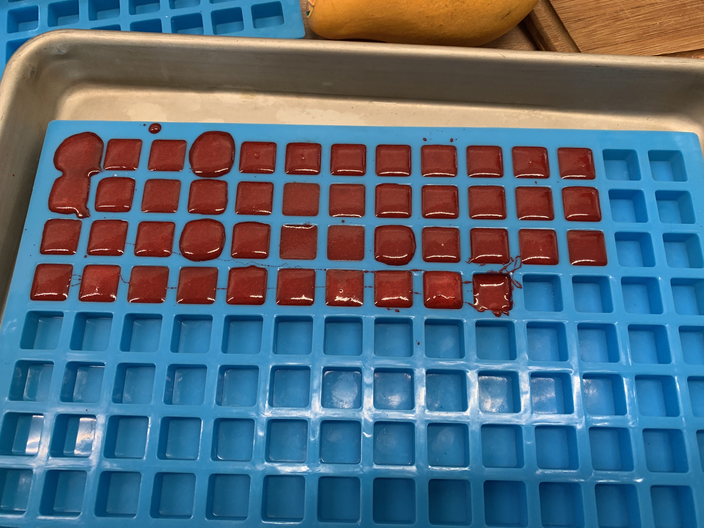
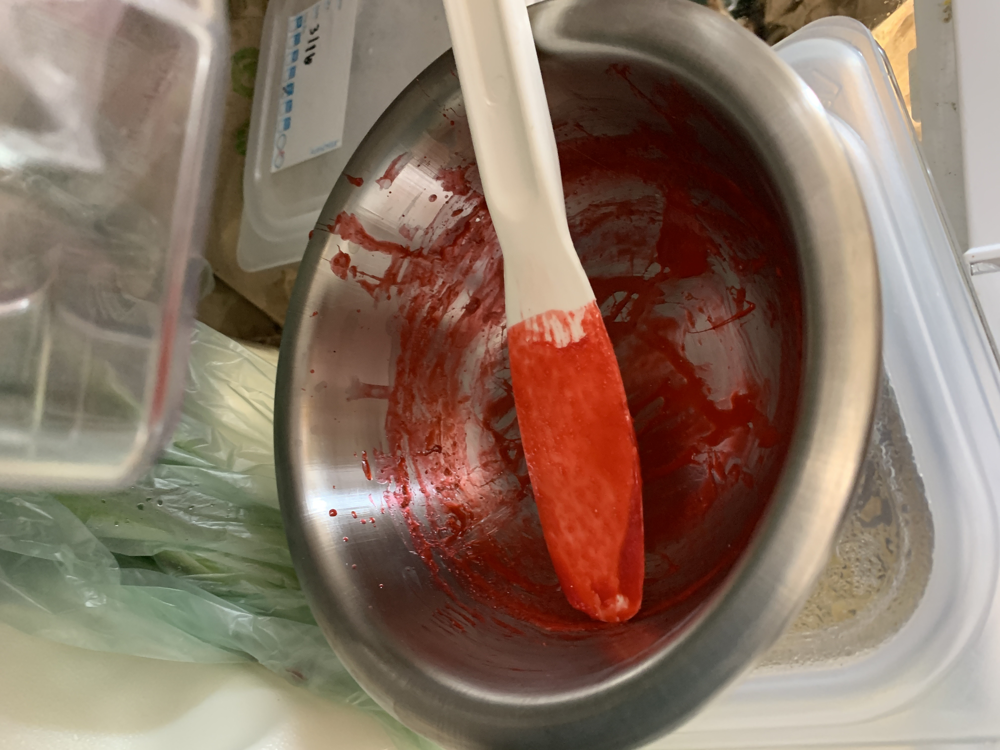
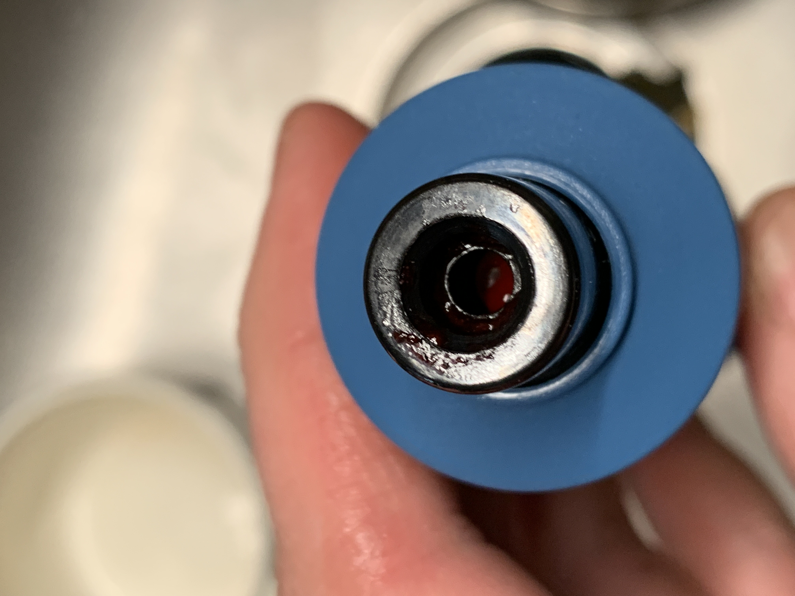
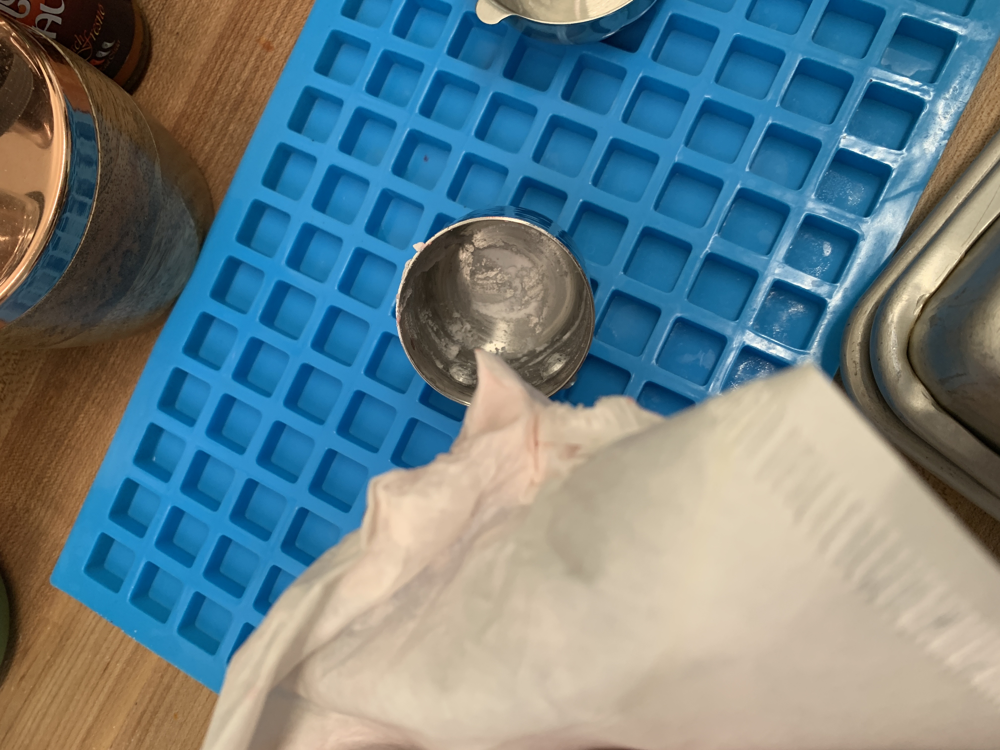

# Gelatin

## Next Steps
<https://sugargeekshow.com/recipe/real-gummy-bear-recipe/>
<https://www.youtube.com/watch?v=5-gIY7HuJNo> potassium sorbate
<https://greenpablo.com/haribo-style-texture-infused-shelf-secure-mountain-dew-fizzy-soda-bottle-gummies/>
[Potassium sorbate is just for mold inhibition](https://www.reddit.com/r/CandyMakers/comments/e9rv48/wine_potassium_sorbate_in_gummy_bear_making)

- Heat while jello is blooming can hurt the protein?

- [x] [Pipettor](https://www.amazon.com/gp/product/B07Y1BDGWW)
  - [x] [Pipettes](https://www.amazon.com/gp/product/B01N65NXHA)
- [x] Molds. Would be clutch to have 3d molds
  - [x] [Multi ML](https://www.amazon.com/gp/product/B0832GFTXX)
  - [x] [Single ML](https://www.amazon.com/gp/product/B07QZ34SMV)
- [ ] Last: Figure out volume adjustment for gelatin plus H20
- [ ] Determine if Jello® works for gummies
- [ ] Figure out raw gelatin process
- [ ] Hotplate based mixing? Flask?
- [ ] Figure out size per gummy.

## 5th experiment 2021-03-18 Drugs
### Ingredients
- 1/4c water
- 3.5oz cherry jello. estimate about 80 cubes?
- scant tablespoon posassium sorbate
- 20x 70mg lisdexamfetamine capsules

### Procedure
1. Grab double sided bowl, plus single sided bowl for bain marie
2. Dissolve lisdexamfetamine
   2. place total powder in 1/3c measure
   3. Added 1/12c water at a time, through multiple piptettings.
      1. Repeat 3x.
         1. Add 1/9c water,
         2. stir, allow to settle,
         3. pipette out the 1/12c
         4. Add to different 1/4c container.
3. added cold water and vyvanse to jello and sorbate in single wall bowl, start stirring while:
4. Begin boiling water
5. Set up double 'boiler'
6. put cold gel sludge above new water in double boiler, keep stirring
   1. solution gradually turned translucent
   2. stirred 12:55-1308. still a bit grainy
7. Began pipetting.
   3. Rectangle held 2.7ml h2o.
   4. Only held 2.3ml material- less viscous.
   5. Took from 1308- 13:34
8. .
9. 
10. 
11. 

### End Notes  
- ~30mg per capsule. Next time 23 or 24x 70mg capsules to start.
- Spatual for stirring was long and annoying to set anywhere, need shorter spat so it can rest in bowl.
- Towards end, was annoying to have bowl unable to rest on corner to condense liquid due to long spatula.
- Condition of material far more viscous at the end, maybe due to evaporation. Needed frequent stirring to remove film from surface

- Need to weigh early and late cubes, test if difference in density.
- Seems successful, and i'll be able to split my dose during the day more easily now.

### Revised Procedure
1. Grab double sided bowl, plus single sided bowl for bain marie
2. Dissolve lisdexamfetamine
   1. > Hard to be sure i was dissolving everything. hard to filter with pipette.
   2. place total powder in 1/3c measure
   3. Added 1/12c water at a time, through multiple piptettings.
      1. Repeat 3x.
         1. Add 1/9c water,
         2. stir, allow to settle,
         3. pipette out the 1/12c
         4. Add to different 1/4c container.
3. added cold water and vyvanse to jello and sorbate in single wall bowl, start stirring while:
4. Begin boiling water
5. Set up double 'boiler'
6. put cold gel sludge above new water in double boiler, keep stirring
   1. solution gradually turned translucent
   2. stirred 12:55-1308. still a bit grainy
7. Began pipetting.
   1. Rectangle held 2.7ml h2o.
   2. Only held 2.3ml material- less viscous.
   3. Took between 1308- 13:34
8. Yeild 46 pieces. significant waste in bowl, spatula, pipette- estimate 2 cubes. will weigh later.
9. Found I had aspirated material into pipette.

## 4th Experiement 2021-03-17 Density
- 1/3 c water, 6oz jello®
  - Didn't set when cold, v. grainy.
  - Next time keep it in a heat bath if I try & go this hard
- 2.4ml for a nicely overfilled light blue square with rounded corners
  - 236.5882375ml per half-cup = 98 cubes from the water alone. try for 1/4 cup

## 3rd Experiement 2021-03-16 Molds!
2/3c water, large jello.
- Dissolved fine, worked well but a little flimsy

1/2c water? what did i do second?
- Sweet spot so far.x

## 2nd Experiment 2021-03-15
Small Jello® in bowl- 3oz in .25c H20
- Difficult to dissolve.
  - Preheated bowl and measuring cup.
  - Stirred in bain marie.
  - Stirred continuously till it began to thicken.
  - Could see chunks inside the whole time.
- Poured into v. lightly greased bowl for cooling.
- tacky as shit when removed.
  - Placed on cooling rack in front of fan @ 16:10

## First Experiment 2021-03-14
Large Jello® Packet (6oz) in .75c H20 @ 200°F
- Easy to Dissolve
- Settled into 2 layers
  - Top Layer felt like jello, but very firm and cohesive
  - Bottom layer felt like plastic or something, more like what I'd want.
  - Neither layer really seemed like it'd be safe in your pocket.
- Was able to release from cup, as thick cube thing. Not easy though.
  - Next time need a technique- put cup in boiling water to heat outer layer?
  - blow air underneath it with compressor?

## Process
- [ ] Filter magnesium stearate
